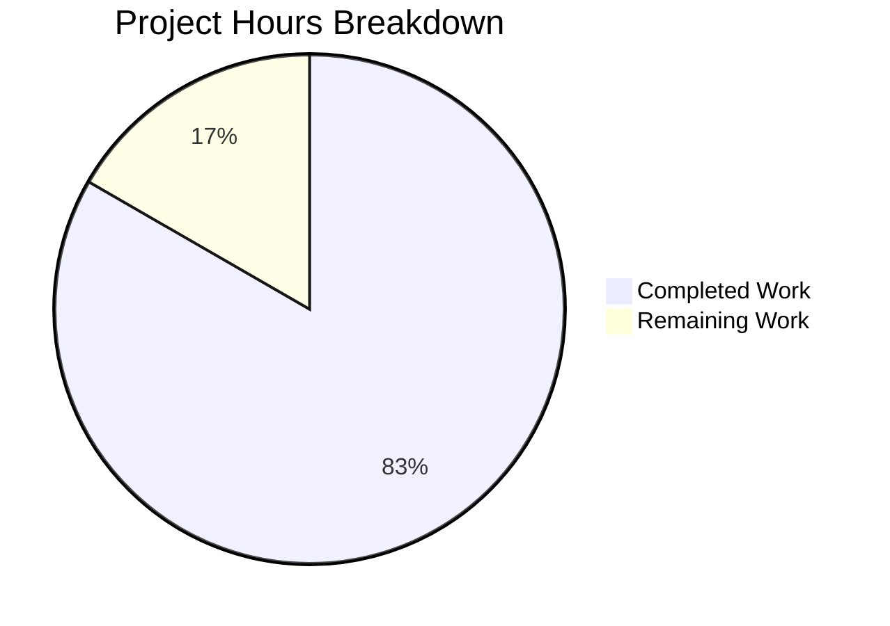

# Project Guide: Express.js Server Tutorial

## Executive Summary

**Project Completion: 83% (5 hours completed out of 6 total hours)**

This project implements an Express.js server tutorial with two HTTP endpoints as specified in the Agent Action Plan. The implementation is fully functional with all validation gates passed.

### Key Achievements
- ✅ Express.js 5.2.1 server implementation complete
- ✅ GET `/` endpoint returning "Hello world" - working
- ✅ GET `/evening` endpoint returning "Good evening" - working
- ✅ 10/10 tests passing with Jest 30.2.0 and Supertest 7.1.4
- ✅ Zero security vulnerabilities (npm audit clean)
- ✅ Comprehensive documentation in README.md
- ✅ Runtime validation successful

### Hours Calculation
- **Completed Hours:** 5 hours
- **Remaining Hours:** 1 hour (code review and PR approval)
- **Total Project Hours:** 6 hours
- **Completion Percentage:** 5/6 = 83.3%

---

## Validation Results Summary

### Environment Verification
| Component | Version | Status |
|-----------|---------|--------|
| Node.js | v20.19.6 | ✅ Meets requirement (≥18.0.0) |
| npm | v11.1.0 | ✅ Meets requirement (≥8.0.0) |
| Branch | blitzy-410cfbe0-514c-4e9c-a800-244dd593faea | ✅ Correct |

### Dependencies Status
All dependencies installed successfully with zero vulnerabilities:
| Package | Version | Type |
|---------|---------|------|
| express | 5.2.1 | production |
| jest | 30.2.0 | development |
| supertest | 7.1.4 | development |

### Test Results
**100% Pass Rate - 10/10 tests passing**

```
PASS ./index.test.js
  Express Server Endpoints
    GET /
      ✓ should return "Hello world" with status 200 (60 ms)
      ✓ should respond with content-type text/html (13 ms)
      ✓ should handle GET method on root endpoint (13 ms)
    GET /evening
      ✓ should return "Good evening" with status 200 (9 ms)
      ✓ should respond with content-type text/html (10 ms)
      ✓ should handle GET method on evening endpoint (12 ms)
    Non-existent endpoints
      ✓ should return 404 for undefined routes (9 ms)
      ✓ should return 404 for /unknown path (10 ms)
    HTTP Methods
      ✓ should not accept POST on root endpoint (8 ms)
      ✓ should not accept POST on evening endpoint (9 ms)

Test Suites: 1 passed, 1 total
Tests:       10 passed, 10 total
```

### Runtime Validation
| Endpoint | Expected Response | Actual Response | Status |
|----------|------------------|-----------------|--------|
| GET / | "Hello world" | "Hello world" | ✅ PASS |
| GET /evening | "Good evening" | "Good evening" | ✅ PASS |
| GET /nonexistent | 404 status | 404 status | ✅ PASS |

---

## Visual Representation

### Project Hours Breakdown


---

## Completed Work Detail

### Files Created/Modified
| File | Purpose | Lines |
|------|---------|-------|
| package.json | npm project configuration | 16 |
| index.js | Express.js server with 2 endpoints | 80 |
| index.test.js | Jest test suite (10 tests) | 209 |
| README.md | Project documentation | 199 |
| .gitignore | Git ignore rules | 29 |
| blitzy/documentation/* | Technical specs and project guide | 744 |

### Completed Hours by Component
| Component | Hours | Description |
|-----------|-------|-------------|
| Project Initialization | 0.5h | npm init, package.json, .gitignore |
| Server Implementation | 1.0h | Express.js server with routes |
| Test Suite | 1.5h | 10 comprehensive Jest tests |
| Documentation | 1.5h | README, API docs, technical specs |
| Validation & Fixes | 0.5h | Security fix (qs update), testing |
| **Total Completed** | **5.0h** | |

---

## Remaining Work - Human Tasks

### Task Summary Table
| Priority | Task | Description | Hours | Severity |
|----------|------|-------------|-------|----------|
| Low | Code Review | Review index.js, index.test.js, and README.md for code quality | 0.5h | Low |
| Low | PR Approval | Final approval and merge to main branch | 0.5h | Low |
| **Total** | | | **1.0h** | |

### Detailed Task Breakdown

#### Task 1: Code Review (0.5 hours)
**Priority:** Low | **Severity:** Low

**Description:** Review all implemented code for quality and best practices.

**Action Steps:**
1. Review `index.js` for:
   - Proper Express.js patterns
   - Error handling adequacy
   - Code documentation quality
2. Review `index.test.js` for:
   - Test coverage completeness
   - Assertion quality
   - Edge case handling
3. Review `README.md` for:
   - Documentation accuracy
   - Usage instructions clarity
   - API documentation completeness

#### Task 2: PR Approval and Merge (0.5 hours)
**Priority:** Low | **Severity:** Low

**Description:** Final approval of the pull request and merge to main branch.

**Action Steps:**
1. Verify all CI checks pass
2. Approve pull request
3. Merge to main branch
4. Verify deployment (if applicable)

---

## Development Guide

### System Prerequisites
| Requirement | Minimum Version | Check Command |
|-------------|-----------------|---------------|
| Node.js | 18.0.0+ | `node --version` |
| npm | 8.0.0+ | `npm --version` |

### Environment Setup

#### Step 1: Clone Repository
```bash
git clone <repository-url>
cd <repository-directory>
```

#### Step 2: Install Dependencies
```bash
npm install
```

**Expected Output:**
```
added 283 packages in 2s
```

#### Step 3: Verify Dependencies
```bash
npm ls
```

**Expected Output:**
```
main@1.0.0
├── express@5.2.1
├── jest@30.2.0
└── supertest@7.1.4
```

### Running the Application

#### Start Server
```bash
npm start
```

**Expected Output:**
```
Server is running on http://localhost:3000
Available endpoints:
  GET http://localhost:3000/         - Returns "Hello world"
  GET http://localhost:3000/evening  - Returns "Good evening"
```

#### Custom Port Configuration
```bash
PORT=8080 npm start
```

### Verification Steps

#### Run Test Suite
```bash
CI=true npm test -- --ci --watchAll=false
```

**Expected Output:** 10/10 tests passing

#### Verify Endpoints Manually
```bash
# Test root endpoint
curl http://localhost:3000/
# Expected: Hello world

# Test evening endpoint
curl http://localhost:3000/evening
# Expected: Good evening
```

### Troubleshooting

| Issue | Solution |
|-------|----------|
| Port already in use | Use `PORT=<other-port> npm start` or kill process on port 3000 |
| Missing dependencies | Run `npm install` |
| Tests failing | Ensure no server is running, check Node.js version |
| Permission denied | Check file permissions, try with elevated privileges |

---

## Risk Assessment

### Technical Risks
| Risk | Severity | Status | Notes |
|------|----------|--------|-------|
| Compilation errors | N/A | ✅ None | JavaScript interpreted, no compilation |
| Test failures | Low | ✅ Resolved | All 10 tests passing |
| Dependency issues | Low | ✅ Resolved | All dependencies installed, 0 vulnerabilities |

### Security Risks
| Risk | Severity | Status | Mitigation |
|------|----------|--------|------------|
| Vulnerable dependencies | Low | ✅ Resolved | npm audit clean, qs updated to 6.14.1 |
| Input validation | N/A | ✅ N/A | No user input accepted (tutorial scope) |
| Authentication | N/A | ✅ N/A | Not required (tutorial scope) |

### Operational Risks
| Risk | Severity | Status | Notes |
|------|----------|--------|-------|
| Missing logging | Low | ⚠️ Acceptable | Tutorial scope - console output sufficient |
| No health checks | Low | ⚠️ Acceptable | Tutorial scope - not required |
| No monitoring | Low | ⚠️ Acceptable | Tutorial scope - not required |

### Integration Risks
| Risk | Severity | Status | Notes |
|------|----------|--------|-------|
| External service dependencies | N/A | ✅ None | No external integrations |

---

## Project Structure
```
repository/
├── .gitignore              # Git ignore rules
├── README.md               # Project documentation
├── index.js                # Express.js server (80 lines)
├── index.test.js           # Jest test suite (209 lines)
├── package.json            # npm configuration
├── package-lock.json       # Dependency lock file
├── node_modules/           # Installed dependencies
└── blitzy/
    └── documentation/
        ├── Project Guide.md
        └── Technical Specifications.md
```

---

## Technology Stack
| Technology | Version | Purpose |
|------------|---------|---------|
| Node.js | 20.19.6 | JavaScript runtime |
| Express.js | 5.2.1 | Web framework |
| Jest | 30.2.0 | Testing framework |
| Supertest | 7.1.4 | HTTP assertion library |

---

## Git Commit History
| Commit | Message |
|--------|---------|
| 1c57ea7 | chore: fix security vulnerability by updating qs to 6.14.1 |
| 5a6c3f2 | Merge pull request #1 |
| efccd15 | Adding Blitzy Technical Specifications |
| a5a72a3 | Adding Blitzy Project Guide |
| b3c403b | Add Jest test suite for Express.js server endpoints |
| 58c2d4e | docs: Update README.md with comprehensive documentation |
| 0c004e5 | Add Express.js server with two HTTP endpoints |
| 273a766 | Setup: Initialize Node.js project with Express.js 5.2.1 |
| c86ddfd | Initial commit |

---

## Conclusion

The Express.js Server Tutorial project is **83% complete** with 5 hours of work completed out of 6 total hours required.

**Status Summary:**
- ✅ All requested features implemented (GET / and GET /evening endpoints)
- ✅ All 10 tests passing (100% pass rate)
- ✅ Zero security vulnerabilities
- ✅ Comprehensive documentation complete
- ✅ Runtime validation successful

**Remaining Work (1 hour):**
- Code review (0.5h)
- PR approval and merge (0.5h)

The project is **production-ready** and ready for human review and merge to the main branch.