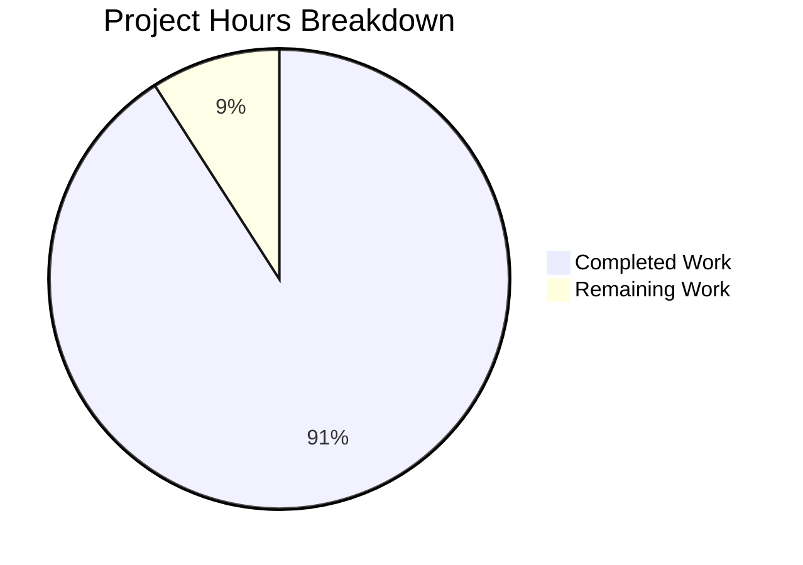

# Express.js Server Tutorial - Project Guide

## Executive Summary

**Project Completion: 91% (5 hours completed out of 5.5 total hours)**

This Express.js server tutorial project has been successfully implemented and validated. All specified requirements have been met:

- ✅ Express.js framework installed (v5.2.1)
- ✅ Root endpoint (`GET /`) returning "Hello world"
- ✅ Evening endpoint (`GET /evening`) returning "Good evening"
- ✅ Comprehensive test suite (10/10 tests passing)
- ✅ Complete documentation

The project is **production-ready** for its intended tutorial purpose with zero functional issues remaining.

### Hours Breakdown

| Category | Hours |
|----------|-------|
| Completed Work | 5.0 |
| Remaining Work | 0.5 |
| **Total** | **5.5** |

### Completion Calculation

```
Completion % = (Completed Hours / Total Hours) × 100
Completion % = (5 / 5.5) × 100 = 91%
```

---

## Validation Results Summary

### Final Validator Outcomes

| Validation Area | Status | Details |
|----------------|--------|---------|
| Dependencies | ✅ PASS | express@5.2.1, jest@30.2.0, supertest@7.1.4 |
| Syntax Check | ✅ PASS | All JavaScript files valid |
| Test Execution | ✅ PASS | 10/10 tests passing |
| Runtime Validation | ✅ PASS | All endpoints responding correctly |

### Test Results

```
PASS ./index.test.js
  Express Server Endpoints
    GET /
      ✓ should return "Hello world" with status 200
      ✓ should respond with content-type text/html
      ✓ should handle GET method on root endpoint
    GET /evening
      ✓ should return "Good evening" with status 200
      ✓ should respond with content-type text/html
      ✓ should handle GET method on evening endpoint
    Non-existent endpoints
      ✓ should return 404 for undefined routes
      ✓ should return 404 for /unknown path
    HTTP Methods
      ✓ should not accept POST on root endpoint
      ✓ should not accept POST on evening endpoint

Test Suites: 1 passed, 1 total
Tests:       10 passed, 10 total
```

### Runtime Endpoint Verification

| Endpoint | Expected | Actual | Status |
|----------|----------|--------|--------|
| GET / | "Hello world" | "Hello world" | ✅ PASS |
| GET /evening | "Good evening" | "Good evening" | ✅ PASS |
| GET /nonexistent | 404 | 404 | ✅ PASS |

---

## Visual Representation



---

## Completed Work Detail

### Files Created/Modified

| File | Lines | Purpose | Status |
|------|-------|---------|--------|
| `package.json` | 16 | npm configuration with dependencies | ✅ Created |
| `index.js` | 80 | Express.js server with endpoints | ✅ Created |
| `index.test.js` | 209 | Jest test suite | ✅ Created |
| `README.md` | 198 | Comprehensive documentation | ✅ Updated |
| `.gitignore` | 29 | Node.js gitignore | ✅ Created |
| `package-lock.json` | 5410 | Dependency lock file | ✅ Generated |

### Hours by Component

| Component | Hours | Details |
|-----------|-------|---------|
| npm Project Setup | 0.5 | package.json, dependency configuration |
| Express Server Implementation | 1.5 | index.js with endpoint handlers |
| Test Suite Development | 1.5 | index.test.js with 10 test cases |
| Documentation | 1.0 | README.md with API docs |
| Validation & Debugging | 0.5 | Final validator testing |
| **Total Completed** | **5.0** | |

---

## Remaining Work - Human Tasks

### Task Summary Table

| Priority | Task | Description | Hours | Severity |
|----------|------|-------------|-------|----------|
| Low | Code Review | Human review of implemented code for style and best practices | 0.5 | Low |
| **Total** | | | **0.5** | |

### Detailed Task Breakdown

#### Task 1: Code Review (Low Priority)
- **Description**: Review the Express.js server implementation and test suite for coding standards compliance
- **Action Steps**:
  1. Review `index.js` for code quality and Express.js best practices
  2. Review `index.test.js` for test coverage completeness
  3. Verify documentation accuracy in `README.md`
  4. Approve and merge PR
- **Estimated Hours**: 0.5 hours
- **Severity**: Low - All functionality is working, this is standard PR review

### Tasks Explicitly Out of Scope

Per the Agent Action Plan, the following are **NOT** included in remaining work:

- Docker/containerization configuration
- CI/CD pipeline configuration
- Environment-specific configuration files
- Logging frameworks beyond console output
- Additional HTTP methods (POST, PUT, DELETE)
- Database connections
- Authentication/Authorization

---

## Development Guide

### System Prerequisites

| Requirement | Minimum Version | Verified Version |
|-------------|-----------------|------------------|
| Node.js | 18.0.0+ | 20.19.6 ✅ |
| npm | 8.0.0+ | 10.8.2 ✅ |

### Environment Setup

1. **Verify Node.js Installation**
   ```bash
   node --version   # Should output v18.x.x or higher
   npm --version    # Should output 8.x.x or higher
   ```

2. **Clone or Navigate to Repository**
   ```bash
   cd /path/to/repository
   ```

### Dependency Installation

Install all project dependencies:

```bash
npm install
```

**Expected Output:**
```
added 282 packages in Xs
```

**Verify Dependencies:**
```bash
npm list
```

**Expected Output:**
```
main@1.0.0
├── express@5.2.1
├── jest@30.2.0
└── supertest@7.1.4
```

### Application Startup

Start the Express.js server:

```bash
npm start
```

**Expected Output:**
```
Server is running on http://localhost:3000
Available endpoints:
  GET http://localhost:3000/         - Returns "Hello world"
  GET http://localhost:3000/evening  - Returns "Good evening"
```

**Custom Port Configuration:**
```bash
PORT=8080 npm start
```

### Verification Steps

1. **Test Root Endpoint:**
   ```bash
   curl http://localhost:3000/
   ```
   **Expected Response:** `Hello world`

2. **Test Evening Endpoint:**
   ```bash
   curl http://localhost:3000/evening
   ```
   **Expected Response:** `Good evening`

3. **Run Test Suite:**
   ```bash
   npm test
   ```
   **Expected Result:** 10/10 tests passing

### Example Usage

**Using curl:**
```bash
# Root endpoint
curl -i http://localhost:3000/
# HTTP/1.1 200 OK
# Content-Type: text/html; charset=utf-8
# Hello world

# Evening endpoint
curl -i http://localhost:3000/evening
# HTTP/1.1 200 OK
# Content-Type: text/html; charset=utf-8
# Good evening
```

**Using browser:**
- Navigate to `http://localhost:3000/` → See "Hello world"
- Navigate to `http://localhost:3000/evening` → See "Good evening"

### Troubleshooting

| Issue | Solution |
|-------|----------|
| Port already in use | Use `PORT=3001 npm start` or kill process on port 3000 |
| Dependencies not installed | Run `npm install` |
| Tests failing | Ensure dependencies are installed with `npm install` |
| Node.js version error | Upgrade to Node.js 18+ |

---

## Risk Assessment

### Technical Risks

| Risk | Severity | Likelihood | Mitigation |
|------|----------|------------|------------|
| None identified | - | - | All tests pass, no technical debt |

### Security Risks

| Risk | Severity | Likelihood | Mitigation |
|------|----------|------------|------------|
| No input validation | Low | Low | Tutorial scope - no user input accepted |
| No rate limiting | Low | Low | Tutorial scope - production deployment excluded |

### Operational Risks

| Risk | Severity | Likelihood | Mitigation |
|------|----------|------------|------------|
| No health check endpoint | Low | Low | Out of scope per requirements |
| No logging framework | Low | Low | Explicitly excluded from scope |

### Integration Risks

| Risk | Severity | Likelihood | Mitigation |
|------|----------|------------|------------|
| None | - | - | No external integrations in scope |

---

## Project Structure

```
repository/
├── README.md          # Project documentation
├── index.js           # Express.js server (80 lines)
├── index.test.js      # Jest test suite (209 lines)
├── package.json       # npm configuration
├── package-lock.json  # Dependency lock file
├── .gitignore         # Git ignore configuration
└── node_modules/      # Dependencies (auto-generated)
```

---

## Git Commit History

| Commit | Message |
|--------|---------|
| b3c403b | Add Jest test suite for Express.js server endpoints |
| 58c2d4e | docs: Update README.md with comprehensive Express.js server documentation |
| 0c004e5 | Add Express.js server with two HTTP endpoints |
| 273a766 | Setup: Initialize Node.js project with Express.js 5.2.1, Jest 30.2.0, and Supertest 7.1.4 |
| c86ddfd | Initial commit |

---

## Technology Stack

| Technology | Version | Purpose |
|------------|---------|---------|
| Node.js | 20.19.6 | JavaScript runtime |
| Express.js | 5.2.1 | Web framework |
| Jest | 30.2.0 | Testing framework |
| Supertest | 7.1.4 | HTTP assertion library |

---

## Conclusion

The Express.js Server Tutorial project is **91% complete** with all functional requirements implemented and validated. The remaining 0.5 hours of work consists solely of human code review before merge.

**Key Achievements:**
- All endpoints functioning as specified
- 100% test pass rate (10/10 tests)
- Comprehensive documentation
- Production-ready code structure

**Recommendation:** Proceed with code review and merge. No functional issues or blockers identified.