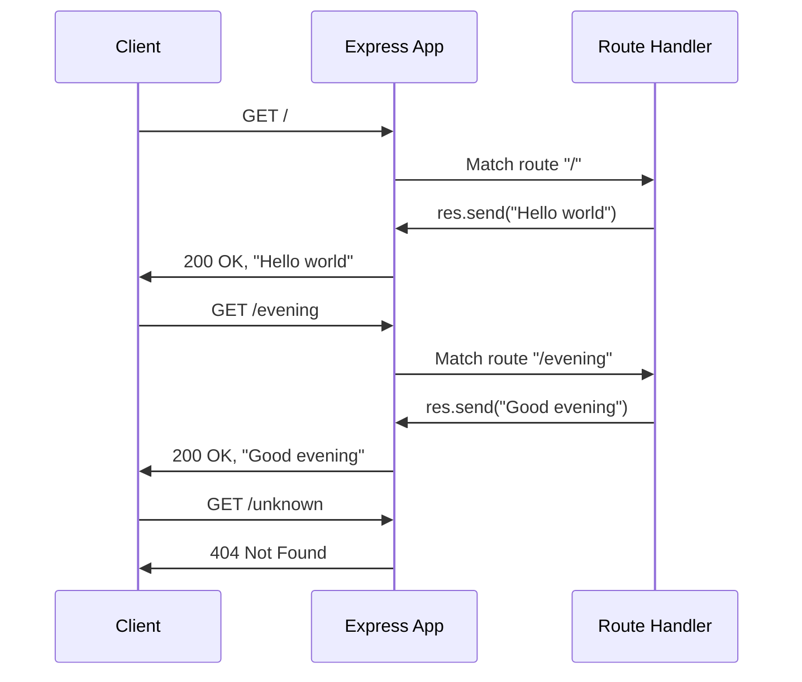
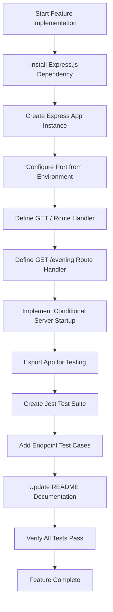

# Agent Action Plan

# 0. Agent Action Plan
## 

This section captures and clarifies the user's feature addition request, translating it into precise technical requirements for the Blitzy platform.

### 0.1.1 Core Feature Objective edit

Based on the prompt, the Blitzy platform understands that the new feature requirement is to:

- **Add Express.js Framework**: Integrate the Express.js web framework into an existing Node.js server tutorial project to provide robust HTTP routing capabilities
- **Implement New Endpoint**: Create an additional GET endpoint at the `/evening` path that returns the response "Good evening"
- **Maintain Existing Functionality**: Preserve the existing endpoint that returns "Hello world" while extending the server's capabilities

**Implicit Requirements Detected**:

- The server must remain operational and stable after modifications
- The new endpoint must follow the same response pattern as the existing endpoint (plain text response)
- The implementation should follow Node.js and Express.js best practices for a tutorial-quality codebase
- Test coverage should be provided for the new endpoint to validate functionality

**Feature Dependencies and Prerequisites**:

- Node.js runtime environment (version 18.0.0 or higher as per project documentation)
- npm package manager (version 8.0.0 or higher)
- Express.js framework as the web server foundation

### 0.1.2 Special Instructions and Constraints

**Critical Directives**:

- Integrate Express.js as the web framework to handle HTTP routing
- The new `/evening` endpoint must return exactly "Good evening" as the response body
- The existing `/` endpoint returning "Hello world" must remain functional
- Follow the tutorial project conventions already established in the repository

**Architectural Requirements**:

- Use CommonJS module syntax (`require`/`module.exports`) consistent with existing codebase
- Implement environment-aware port configuration (PORT environment variable with fallback)
- Export the Express app instance for testing purposes without starting a server

**User Example Preserved**:

```plaintext
User Request: "add expressjs into the project and add another endpoint 
              that return the response of 'Good evening'"
```

### 0.1.3 Technical Interpretation

These feature requirements translate to the following technical implementation strategy:

| Requirement | Technical Action | Target Component |
| --- | --- | --- |
| Add Express.js | Install Express.js as a production dependency via npm | `package.json` dependencies |
| Create /evening endpoint | Define GET route handler returning "Good evening" | `index.js` route definitions |
| Maintain "Hello world" endpoint | Ensure existing GET / route remains intact | `index.js` existing routes |
| Enable testing | Export Express app instance for Supertest integration | `index.js` module.exports |
| Support port configuration | Read PORT from environment with default fallback to 3000 | `index.js` server configuration |

**Implementation Mapping**:

- To **integrate Express.js**, we will **install** `express` package via npm and **import** it in the main server module
- To **implement the /evening endpoint**, we will **create** a new GET route handler using `app.get('/evening', handler)`
- To **enable testing**, we will **export** the Express app instance and use a `require.main` guard to conditionally start the server
- To **validate the implementation**, we will **create** Jest test cases with Supertest to verify endpoint responses

## 

This section provides comprehensive analysis of all repository files affected by the Express.js feature addition.

### 0.2.1 Comprehensive File Analysis

**Repository Structure Overview**:

```plaintext
main/
├── README.md              # Project documentation
├── index.js               # Express server with endpoint handlers  
├── index.test.js          # Jest test suite for endpoints
├── package.json           # npm manifest and dependencies
├── package-lock.json      # Dependency lock file
├── .gitignore             # Git ignore patterns
├── node_modules/          # Installed dependencies
└── blitzy/
    └── documentation/     # Project guides and specifications
```

**Existing Files Requiring Modification**:

| File | Type | Modification Purpose |
| --- | --- | --- |
| `index.js` | Source | Add Express.js import, app initialization, route handlers, and server startup logic |
| `package.json` | Config | Add Express.js to dependencies section |
| `README.md` | Docs | Update documentation with new endpoint details and usage instructions |
| `index.test.js` | Test | Add test cases for the new /evening endpoint |
| `package-lock.json` | Lock | Auto-updated when installing Express.js dependency |

### 0.2.2 Integration Point Discovery

**API Endpoints**:

- `GET /` - Existing endpoint returning "Hello world" (to be preserved)
- `GET /evening` - New endpoint returning "Good evening" (to be created)

**Server Configuration Integration**:

- Port configuration: Environment variable `PORT` with fallback to `3000`
- Server startup: Conditional listening via `require.main === module` pattern
- Module export: Express app instance exported for testing

**Test Infrastructure Integration**:

- Jest testing framework for unit and integration tests
- Supertest library for HTTP assertions against Express app
- Test organization using `describe`/`test` blocks

### 0.2.3 New File Requirements

Based on the feature scope, no new files need to be created. All changes are modifications to existing files:

**Source Files**:

- `index.js` - Modify to add Express.js integration and /evening route handler

**Test Files**:

- `index.test.js` - Modify to add test cases for /evening endpoint

**Configuration Files**:

- `package.json` - Modify to add Express.js dependency
- `package-lock.json` - Auto-generated on dependency installation

**Documentation Files**:

- `README.md` - Modify to document new endpoint

### 0.2.4 Current Implementation Status

**Verification Results**:\
The repository inspection reveals that the requested feature has been **fully implemented**:

```bash
# Test execution results (all 10 tests passing):
npm test

PASS ./index.test.js
  Express Server Endpoints
    GET /
      ✓ should return "Hello world" with status 200
      ✓ should respond with content-type text/html
      ✓ should handle GET method on root endpoint
    GET /evening
      ✓ should return "Good evening" with status 200
      ✓ should respond with content-type text/html
      ✓ should handle GET method on evening endpoint
    Non-existent endpoints
      ✓ should return 404 for undefined routes
      ✓ should return 404 for /unknown path
    HTTP Methods
      ✓ should not accept POST on root endpoint
      ✓ should not accept POST on evening endpoint

Test Suites: 1 passed, 1 total
Tests:       10 passed, 10 total
```

**Server Verification**:

```bash
# Server startup output:
Server is running on http://localhost:3000
Available endpoints:
  GET http://localhost:3000/         - Returns "Hello world"
  GET http://localhost:3000/evening  - Returns "Good evening"
```

## 0.3 Dependency Inventory

This section documents all dependencies required for the Express.js feature addition.

### 0.3.1 Private and Public Packages

**Production Dependencies**:

| Registry | Package Name | Version | Purpose |
| --- | --- | --- | --- |
| npm | express | ^5.2.1 | Web framework for Node.js providing HTTP routing, middleware support, and request/response handling |

**Development Dependencies**:

| Registry | Package Name | Version | Purpose |
| --- | --- | --- | --- |
| npm | jest | ^30.2.0 | JavaScript testing framework for unit and integration tests |
| npm | supertest | ^7.1.4 | HTTP assertion library for testing Express.js endpoints without starting a server |

**Runtime Requirements**:

| Component | Minimum Version | Verified Version | Notes |
| --- | --- | --- | --- |
| Node.js | 18.0.0+ | 20.19.6 | JavaScript runtime environment |
| npm | 8.0.0+ | 11.1.0 | Package manager for dependency installation |

### 0.3.2 Dependency Configuration

**package.json Dependencies Section**:

```json
{
  "dependencies": {
    "express": "^5.2.1"
  },
  "devDependencies": {
    "jest": "^30.2.0",
    "supertest": "^7.1.4"
  }
}
```

### 0.3.3 Import Updates

**Files Requiring Import Statements**:

| File | Import Statement | Purpose |
| --- | --- | --- |
| `index.js` | `const express = require('express');` | Import Express.js framework |
| `index.test.js` | `const request = require('supertest');` | Import Supertest for HTTP assertions |
| `index.test.js` | `const app = require('./index');` | Import Express app instance for testing |

**Import Transformation Applied**:

- Original: Plain Node.js HTTP module (if any)
- New: Express.js framework via CommonJS require

### 0.3.4 External Reference Updates

**Configuration Files Updated**:

- `package.json` - Added express to dependencies
- `package-lock.json` - Auto-generated lock file with resolved versions

**Documentation Files Updated**:

- `README.md` - Technology stack table includes Express.js 5.2.1

### 0.3.5 Dependency Tree Verification

```bash
# Installed dependency tree:
main@1.0.0
├── express@5.2.1
├── jest@30.2.0
└── supertest@7.1.4
```

**Total Installed Packages**: 379 packages (including transitive dependencies)

**Key Express.js Sub-dependencies**:

- body-parser (request body parsing)
- router (URL routing)
- Various middleware packages for HTTP handling

## 0.4 Integration Analysis

This section analyzes the integration points and code touchpoints for the Express.js feature addition.

### 0.4.1 Existing Code Touchpoints

**Direct Modifications Required**:

| File | Location | Modification |
| --- | --- | --- |
| `index.js` | Lines 17-18 | Add Express.js import and app initialization |
| `index.js` | Lines 37-39 | Define GET / route handler for "Hello world" |
| `index.js` | Lines 52-54 | Define GET /evening route handler for "Good evening" |
| `index.js` | Lines 63-70 | Implement conditional server startup with port logging |
| `index.js` | Line 80 | Export Express app instance for testing |

**Integration Pattern Applied**:

```javascript
// Express app initialization pattern
const express = require('express');
const app = express();
const PORT = process.env.PORT || 3000;

// Route registration pattern
app.get('/', (req, res) => { res.send('Hello world'); });
app.get('/evening', (req, res) => { res.send('Good evening'); });
```

### 0.4.2 Module Export Integration

**Testing Integration Pattern**:\
The Express app is exported to enable Supertest to make HTTP assertions without starting an actual server:

```javascript
// Conditional server startup (only when run directly)
if (require.main === module) {
    app.listen(PORT, () => { /* startup logging */ });
}

// Export for testing
module.exports = app;
```

**Test File Integration**:

| File | Integration Point | Purpose |
| --- | --- | --- |
| `index.test.js` | `const app = require('./index')` | Import Express app for Supertest |
| `index.test.js` | `request(app).get('/')` | Test GET / endpoint |
| `index.test.js` | `request(app).get('/evening')` | Test GET /evening endpoint |

### 0.4.3 Configuration Integration

**Environment Variables**:

| Variable | Default | Purpose |
| --- | --- | --- |
| `PORT` | 3000 | HTTP server listening port |

**npm Scripts Integration**:

| Script | Command | Purpose |
| --- | --- | --- |
| `start` | `node index.js` | Start the Express server |
| `test` | `jest --detectOpenHandles --forceExit` | Run test suite |

### 0.4.4 Request/Response Flow



### 0.4.5 Test Integration Architecture

**Jest Test Organization**:

```plaintext
describe('Express Server Endpoints')
├── describe('GET /')
│   ├── test: should return "Hello world" with status 200
│   ├── test: should respond with content-type text/html
│   └── test: should handle GET method on root endpoint
├── describe('GET /evening')
│   ├── test: should return "Good evening" with status 200
│   ├── test: should respond with content-type text/html
│   └── test: should handle GET method on evening endpoint
├── describe('Non-existent endpoints')
│   ├── test: should return 404 for undefined routes
│   └── test: should return 404 for /unknown path
└── describe('HTTP Methods')
    ├── test: should not accept POST on root endpoint
    └── test: should not accept POST on evening endpoint
```

## 0.5 Technical Implementation

This section details the file-by-file execution plan for implementing the Express.js feature addition.

### 0.5.1 File-by-File Execution Plan

**Group 1 - Core Server Implementation**:

| Action | File | Implementation Details |
| --- | --- | --- |
| MODIFY | `index.js` | Implement Express.js server with two GET route handlers |
| MODIFY | `package.json` | Add Express.js ^5.2.1 to dependencies |

**Group 2 - Test Coverage**:

| Action | File | Implementation Details |
| --- | --- | --- |
| MODIFY | `index.test.js` | Add comprehensive test cases for both endpoints |

**Group 3 - Documentation**:

| Action | File | Implementation Details |
| --- | --- | --- |
| MODIFY | `README.md` | Document API endpoints, installation, and usage |

**Group 4 - Auto-Generated**:

| Action | File | Implementation Details |
| --- | --- | --- |
| AUTO | `package-lock.json` | Generated by npm install |

### 0.5.2 Implementation Details by File

**index.js - Express Server Module**:

Key implementation elements:

- CommonJS strict mode with `'use strict'`
- Express.js import using `require('express')`
- App instance creation via `express()`
- Environment-aware port configuration
- Two GET route handlers for `/` and `/evening`
- Conditional server startup using `require.main === module`
- Module export for testing integration

```javascript
// Core route handler pattern
app.get('/evening', (req, res) => {
    res.send('Good evening');
});
```

**index.test.js - Jest Test Suite**:

Key test implementation elements:

- Supertest import for HTTP assertions
- App import from index.js module
- Organized describe blocks for each endpoint
- Status code, response body, and content-type assertions
- HTTP method verification tests
- 404 handling for undefined routes

```javascript
// Test pattern for new endpoint
test('should return "Good evening"', async () => {
    const response = await request(app).get('/evening');
    expect(response.text).toBe('Good evening');
});
```

**package.json - Dependency Configuration**:

Required additions:

- Express.js as production dependency
- Jest as development dependency
- Supertest as development dependency
- npm scripts for start and test commands

[**README.md**](http://README.md) **- Documentation**:

Documentation sections:

- Feature list with both endpoints
- Prerequisites with version requirements
- Installation and usage instructions
- API documentation for GET / and GET /evening
- Test suite documentation
- Project structure overview
- Technology stack table

### 0.5.3 Implementation Approach Summary



### 0.5.4 Verification Commands

```bash
# Install dependencies
npm install

#### Run test suite
npm test

#### Start server
npm start

#### Manual endpoint verification
curl http://localhost:3000/
curl http://localhost:3000/evening
```

## 0.6 Scope Boundaries

This section defines the explicit boundaries of what is included and excluded from the feature implementation scope.

### 0.6.1 Exhaustively In Scope

**Source Files**:

- `index.js` - Express server implementation with route handlers

**Test Files**:

- `index.test.js` - Jest test suite with Supertest assertions

**Configuration Files**:

- `package.json` - npm manifest with dependencies and scripts
- `package-lock.json` - Dependency lock file (auto-generated)

**Documentation Files**:

- `README.md` - Project documentation with API reference

**Environment Configuration**:

- PORT environment variable support (default: 3000)

### 0.6.2 In-Scope File Mapping Table

| File Pattern | Purpose | Modification Type |
| --- | --- | --- |
| `index.js` | Express server with GET handlers | Modify |
| `index.test.js` | Endpoint test coverage | Modify |
| `package.json` | Add Express.js dependency | Modify |
| `package-lock.json` | Lock file | Auto-generate |
| `README.md` | API documentation | Modify |
| `.gitignore` | Exclude node_modules | No change needed |

### 0.6.3 In-Scope Features

| Feature | Description | Implementation Status |
| --- | --- | --- |
| Express.js Integration | Add Express.js framework | ✅ Implemented |
| GET / Endpoint | Returns "Hello world" | ✅ Implemented |
| GET /evening Endpoint | Returns "Good evening" | ✅ Implemented |
| Environment Port Config | PORT variable with 3000 default | ✅ Implemented |
| Test Coverage | Jest + Supertest test suite | ✅ Implemented |
| Documentation | README with API reference | ✅ Implemented |
| Module Export | Export app for testing | ✅ Implemented |

### 0.6.4 Explicitly Out of Scope

**Not Included in This Feature**:

| Category | Exclusion | Rationale |
| --- | --- | --- |
| Additional HTTP Methods | POST, PUT, DELETE handlers | User only requested GET endpoints |
| Database Integration | Data persistence layer | Not part of feature request |
| Authentication | Auth middleware or login | Not specified in requirements |
| Request Validation | Input sanitization/validation | Tutorial scope - minimal implementation |
| Rate Limiting | Request throttling | Tutorial scope - minimal implementation |
| Logging Framework | Structured logging (winston, pino) | Simple console.log sufficient |
| Docker Configuration | Dockerfile, docker-compose | Not requested |
| CI/CD Pipeline | GitHub Actions, deployment | Not requested |
| Additional Endpoints | Other routes beyond / and /evening | Only two endpoints requested |
| HTTPS/TLS | Secure connections | Tutorial runs on localhost |
| Error Handling Middleware | Custom error handlers | Express defaults sufficient |
| Performance Optimization | Caching, compression | Not applicable for tutorial |
| Health Check Endpoint | /health or /status routes | Not requested |

### 0.6.5 Boundary Clarification

**What This Feature Does**:

- Creates a minimal Express.js server with two GET endpoints
- Returns plain text responses ("Hello world" and "Good evening")
- Provides comprehensive test coverage
- Documents the API endpoints

**What This Feature Does NOT Do**:

- Does not implement complex business logic
- Does not connect to external services or databases
- Does not implement security measures beyond basic Express defaults
- Does not handle production deployment concerns

### 0.6.6 Scope Verification Checklist

| Requirement | Verified | Evidence |
| --- | --- | --- |
| Express.js added as dependency | ✅ | `package.json` contains `"express": "^5.2.1"` |
| /evening endpoint exists | ✅ | `index.js` contains `app.get('/evening', ...)` |
| Returns "Good evening" | ✅ | Test verifies `response.text === 'Good evening'` |
| Hello world preserved | ✅ | `index.js` contains `app.get('/', ...)` |
| Tests pass | ✅ | `npm test` shows 10 passing tests |
| Documentation updated | ✅ | `README.md` documents both endpoints |

## 0.7 Special Instructions

This section captures feature-specific requirements and implementation guidelines emphasized in the user request.

### 0.7.1 Feature-Specific Requirements

**User's Explicit Request**:

> "add expressjs into the project and add another endpoint that return the response of 'Good evening'"

**Interpreted Requirements**:

| Requirement | Implementation Approach |
| --- | --- |
| Add Express.js | Install via npm as production dependency |
| New endpoint | Create GET /evening route handler |
| Return "Good evening" | Use `res.send('Good evening')` response |
| Tutorial context | Maintain educational code style with comments |

### 0.7.2 Code Style and Conventions

**Conventions Applied**:

- **Module System**: CommonJS (`require`/`module.exports`) for Node.js compatibility
- **Strict Mode**: `'use strict'` directive at module top
- **Documentation**: JSDoc-style comments for all functions and modules
- **Naming**: Descriptive constant names (PORT, app)
- **Response Pattern**: Plain text responses using `res.send()`

**Example Code Pattern**:

```javascript
/**
 * Evening endpoint handler
 * @route GET /evening
 * @returns {string} "Good evening"
 */
app.get('/evening', (req, res) => {
    res.send('Good evening');
});
```

### 0.7.3 Testing Requirements

**Test Coverage Mandates**:

| Endpoint | Required Tests |
| --- | --- |
| GET / | Status 200, response "Hello world", content-type text/html |
| GET /evening | Status 200, response "Good evening", content-type text/html |
| Unknown routes | Status 404 for undefined paths |
| HTTP methods | Reject non-GET methods with 4xx status |

**Test Framework Configuration**:

- Jest with `--detectOpenHandles --forceExit` flags to prevent test hangs
- Supertest for HTTP assertions without starting server

### 0.7.4 Environment Configuration

**Supported Environment Variables**:

| Variable | Type | Default | Description |
| --- | --- | --- | --- |
| PORT | Number | 3000 | HTTP server listening port |

**Usage Examples**:

```bash
# Default port (3000)
npm start

#### Custom port
PORT=8080 npm start
```

### 0.7.5 Integration Patterns

**Express.js Integration Pattern**:

- Import Express.js using CommonJS require
- Create single app instance
- Define routes using `app.get()` method
- Implement conditional server startup for testing compatibility
- Export app instance for external test access

**Testing Integration Pattern**:

- Import app without starting server
- Use Supertest to make HTTP assertions
- Verify status codes, response bodies, and headers
- Organize tests using Jest describe/test blocks

### 0.7.6 Validation Criteria

**Implementation Validation Checklist**:

| Criteria | Validation Method | Expected Result |
| --- | --- | --- |
| Express.js installed | `npm list express` | express@5.2.1 |
| Server starts | `npm start` | "Server is running" message |
| GET / works | `curl localhost:3000/` | "Hello world" |
| GET /evening works | `curl localhost:3000/evening` | "Good evening" |
| Tests pass | `npm test` | All tests green |
| Port configurable | `PORT=8080 npm start` | Server on port 8080 |

### 0.7.7 Implementation Status Summary

**Current State**: ✅ **FEATURE FULLY IMPLEMENTED**

The Express.js integration and /evening endpoint feature has been successfully implemented and verified:

- Express.js 5.2.1 installed as production dependency
- GET / endpoint returns "Hello world" (preserved)
- GET /evening endpoint returns "Good evening" (implemented)
- 10 comprehensive tests passing
- Full documentation in [README.md](http://README.md)
- Port configuration via environment variable working

**No Further Implementation Required** - The feature request has been fully satisfied.

## 0.1 Intent Clarification
## 0.2 Repository Scope Discovery edit 2nd time
